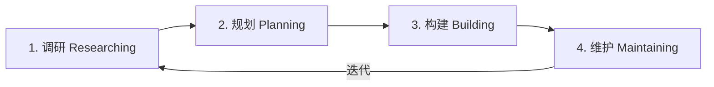

# 🛠️ Web Vibe Coding 系统化工程最佳实践 V4.0

> **适用范围**：风格化个人网站（Project / Post / Route / About）
> **推荐技术栈**：见下方技术栈选型
> **部署平台**：Vercel · **版本管理**：Git + GitHub

---

## 技术栈选型

### 框架

| 框架 | 优势 | 劣势 | 适合场景 |
|---|---|---|---|
| **Next.js (App Router)** | 最成熟的生态与社区；SSG/SSR/ISR 灵活切换；企业级可扩展性 | 对纯静态站点略显重量；学习曲线较陡 | **当前选型 — 兼顾内容展示与未来扩展** |
| Astro | 零 JS 默认输出，极致性能与 SEO；Islands 架构 | 复杂客户端交互能力较弱；生态相对年轻 | 备选 — 纯内容优先站点 |
| Remix | 强大的数据加载与表单处理；渐进增强 | 生态较小；对纯静态内容非最优 | 高交互、重数据的应用 |

> [!TIP]
> **已选 Next.js (App Router)**：兼顾内容展示与未来扩展性，拥有最成熟的生态系统。Astro 作为备选方案保留，适合未来如需极致轻量化时迁移。

### 地图库

| 库 | 许可证 | 费用 | 渲染方式 | 适合场景 |
|---|---|---|---|---|
| **Leaflet** | BSD-2-Clause | 完全免费 | HTML/CSS/Canvas | 简单路线标记、少量坐标点（推荐） |
| **MapLibre GL JS** | BSD-3-Clause | 完全免费 | WebGL (GPU 加速) | 自定义矢量样式、大数据量、3D 地图 |
| Mapbox GL JS | 专有许可 | 免费额度后收费 | WebGL | 需要 Mapbox Studio 工具链 |

> [!IMPORTANT]
> **推荐 Leaflet 或 MapLibre GL JS**。两者 100% 免费开源，无使用量限制。Leaflet 更轻量（~42KB），MapLibre 是 Mapbox GL 的开源分支、功能更强。个人网站用 Leaflet 即可。

### 样式方案

| 方案 | 推荐度 | 说明 |
|---|---|---|
| **Vanilla CSS / CSS Modules** | ⭐⭐⭐⭐⭐ | 零依赖、完全可控、长期维护无迁移风险 |
| TailwindCSS | ⭐⭐⭐ | 开发速度快，但产生框架耦合，版本迁移（v3 to v4）有破坏性变更 |

> [!NOTE]
> TailwindCSS 并非禁止使用，而是**不推荐作为首选**。个人网站追求长期维护，Vanilla CSS 十年后依然正常工作，无版本升级负担。如果你偏好 Tailwind 的开发体验，也完全可以使用。

---

## 阶段总览



| 阶段 | 核心输出物数量 | 关键工具 |
|---|---|---|
| 调研 | 3 份文档 | Figma、NotebookLM、Google Search、Godly.website、Pinterest |
| 规划 | 4 份文档 | AntiGravity、Claude |
| 构建 | 代码 + 1 份日志 | AntiGravity / Claude Code、GitHub |
| 维护 | 2 份文档 + Git | Vercel Analytics、GitHub Issues |

---

## 1. 调研阶段 (Researching)

**核心目标**：确立产品灵魂，将碎片灵感转化为 AI 可理解的结构化知识。

**核心动作**：
1. 视觉审美拆解 — 收集喜欢的设计，**同时标注明确不要的反面案例**
2. 当意向明确时，利用 **Figma** 草拟想要的视觉风格与布局
3. 利用 NotebookLM 协同合成知识
4. 盘点现有内容资产（Project、Post、Route、About 等）

### 输出物

#### `VIBE_MOODBOARD.md` — 视觉氛围板

定义网站的"感觉"。这是 AI 编码中最容易被忽略、但对最终效果影响最大的文件。

**必须包含的板块**：

| 板块 | 内容 | 示例 |
|---|---|---|
| 色彩体系 | 主色、辅色、强调色的 HSL 值或色板链接 | `--primary: hsl(220, 70%, 55%)` |
| 字体搭配 | 标题 / 正文 / 代码字体的 Google Fonts 选择 | Inter + Source Serif Pro |
| 动效节奏 | 过渡时长、缓动函数、滚动动画风格 | 轻盈流畅，ease-out 为主，200-400ms |
| ✅ 正面参考 | 截图 / 链接 + "我喜欢它的哪个点" | "Stripe 的渐变背景和留白比例" |
| ❌ 反面案例 | 截图 / 链接 + "我明确不要什么" | "不要过度拟物、不要彩虹配色" |

> [!TIP]
> 反面案例对 AI 的约束效果极佳。明确"不要什么"往往比"要什么"更能避免 Agent 跑偏。

---

#### `CONTENT_INVENTORY.md` — 内容资产清单

用表格罗列现有内容，确保数据结构设计有据可依。

```markdown
## Project
| 项目名 | 简介 | 技术栈 | 状态 | 素材 |
|--------|------|--------|------|------|
| ...    | ...  | ...    | ...  | ...  |

## Post
| 标题 | 分类 | 日期 | 字数 | 已有文件 |
|------|------|------|------|----------|
| ...  | ...  | ...  | ...  | ...      |

## Route
| 路线名 | 起止点 | 日期 | 坐标文件 | 照片数 |
|--------|--------|------|----------|--------|
| ...    | ...    | ...  | ...      | ...    |

## About
| 项目 | 内容 | 已有素材 |
|------|------|----------|
| 自我介绍 | 个人简介、职业背景、兴趣标签 | ... |
| 社交媒体 | GitHub / X / LinkedIn / ... | ... |
| 联系方式 | Email / 微信 / ... | ... |
```

---

#### `FEATURE_MAP.md` — 功能蓝图

使用 **MoSCoW 优先级分类法**，明确每个功能的优先级。

| 优先级 | 含义 | 示例功能 |
|---|---|---|
| **Must Have** | 没有就不能上线 | 首页、Project 列表页、About 页、响应式布局 |
| **Should Have** | 重要但非阻塞 | Post MDX 渲染、暗色模式 |
| **Could Have** | 锦上添花 | Route 地图动画、阅读进度条 |
| **Won't Have (yet)** | 明确推迟 | 评论系统、Newsletter 订阅 |

---

## 2. 规划阶段 (Planning)

**核心目标**：产出具备"法律效力"的施工指令集，定义数据契约。

**核心动作**：
1. 起草 PRD 母档 — 用**对话式指令风格**编写，而非传统需求文档
2. 定义 JSON Schema — 确立数据契约
3. 配置 AI Agent 约束规则
4. 制定模块化实施路线图

### 输出物

#### `PRD_MASTER.md` — 需求说明书母档（项目宪法）

**地位**：所有文件的母体。AI 生成的代码跑偏时，第一时间回来检查 PRD 哪里没描述清楚。

> [!IMPORTANT]
> PRD 要写成**"对话式指令"**而非纯人类需求文档。差异在于：
> - ❌ 传统写法："系统应支持暗色模式切换功能"
> - ✅ 指令写法："实现一个暗色模式切换按钮，放在导航栏右侧。使用 CSS 变量管理主题色，默认跟随系统偏好，用户手动切换后存入 localStorage"

**推荐章节结构**：

```
1. 产品定义（一句话 + 目标用户）
2. 设计语言（引用 VIBE_MOODBOARD.md）
3. 信息架构（站点地图 + 路由结构）
4. 逐页功能描述（每页的交互细节）
5. 技术约束（必须用 / 禁止用的技术）
6. 数据结构（引用 schema.json）
```

---

#### `.gemini/AGENTS.md` — AI Agent 约束规范

放入项目根目录的 `.gemini/` 文件夹，AntiGravity 会自动读取。

**推荐内容**：
- 技术栈白名单（e.g. 框架、样式方案、地图库的选型决策）
- 禁止事项（e.g. 不引入 jQuery 等过时库）
- 代码风格要求（e.g. 组件用函数式、CSS 用 BEM 命名）
- 文件组织规范（e.g. 组件目录结构）

---

#### `schema.json` — 数据结构规范

规定 Project / Post / Route / About 的标准字段格式。**这是防止数据混乱的关键契约。**

```json
{
  "project": {
    "slug": "string (URL 标识符)",
    "title": "string",
    "description": "string",
    "tags": ["string"],
    "date": "YYYY-MM-DD",
    "coverImage": "string (路径)",
    "featured": "boolean",
    "links": {
      "github": "string | null",
      "live": "string | null"
    }
  },
  "post": {
    "slug": "string",
    "title": "string",
    "excerpt": "string",
    "category": "string",
    "date": "YYYY-MM-DD",
    "readingTime": "number (分钟)",
    "content": "MDX 文件路径"
  },
  "route": {
    "slug": "string",
    "name": "string",
    "description": "string",
    "date": "YYYY-MM-DD",
    "coordinates": "GeoJSON 文件路径",
    "photos": ["string (路径)"],
    "distance": "number (km)"
  },
  "about": {
    "name": "string",
    "title": "string (职业/身份标签)",
    "bio": "string (自我介绍)",
    "avatar": "string (头像路径)",
    "socials": {
      "github": "string | null",
      "x": "string | null",
      "linkedin": "string | null"
    },
    "contact": {
      "email": "string",
      "wechat": "string | null"
    }
  }
}
```

---

#### `IMPLEMENTATION_PLAN.md` — 实施路线图

模块化的开发顺序清单，**按依赖关系排列**。

```markdown
## Phase 1: 基础框架 (Foundation)
- [ ] Next.js (App Router) 项目初始化 + 目录结构
- [ ] 全局设计系统（CSS 变量、字体、间距 Token）
- [ ] 布局组件（Header / Footer / Navigation）
- [ ] 响应式断点系统

## Phase 2: 核心页面 (Core Pages)
- [ ] 首页（Hero + 精选 Project + 最新 Post）
- [ ] Project 列表页 + 详情页
- [ ] Post 列表页 + MDX 文章渲染
- [ ] About 页面（自我介绍 + 社交媒体 + 联系方式）

## Phase 3: 特色功能 (Features)
- [ ] Route 地图（Leaflet / MapLibre GL）
- [ ] 暗色模式切换
- [ ] 页面过渡动画

## Phase 4: 上线打磨 (Polish & Deploy)
- [ ] SEO 优化（meta tags, sitemap, robots.txt）
- [ ] 性能优化（图片优化, 懒加载）
- [ ] Vercel 部署 + 自定义域名
- [ ] Vercel Analytics 启用（自动追踪）
```

---

## 3. 构建阶段 (Building)

**核心目标**：高质量代码实现，以 Git 为唯一版本存证工具。

**核心动作**：
1. 按 `IMPLEMENTATION_PLAN.md` 的 Phase 顺序逐模块推进
2. 每完成一个可视化里程碑，**Git 提交 + 截图存档**
3. 利用 linting + TypeScript 类型检查保障代码质量
4. 遇到复杂逻辑时，在代码注释中记录设计决策

**主要工具**：AntiGravity / Claude Code、GitHub

### 输出物

#### `src/` — 项目源码

推荐目录结构：

```
src/
├── app/                    # Next.js App Router 页面
│   ├── layout.tsx          # 根布局
│   ├── page.tsx            # 首页
│   ├── project/
│   ├── post/
│   ├── route/
│   └── about/
├── components/             # 可复用 UI 组件
│   ├── layout/             # Header, Footer, Navigation
│   ├── ui/                 # Button, Card, Tag 等原子组件
│   └── sections/           # Hero, ProjectGrid 等页面区块
├── styles/                 # CSS 文件
│   ├── globals.css         # 设计系统 Token + 全局样式
│   ├── components/         # 组件级样式（CSS Modules）
│   └── variables.css       # CSS 变量定义
├── content/                # 内容文件
│   ├── project/            # Project MDX/JSON
│   ├── post/               # Post MDX
│   └── route/              # Route GeoJSON
├── lib/                    # 工具函数
│   ├── content.ts          # 内容读取与解析
│   └── utils.ts            # 通用工具
└── public/                 # 静态资源
    └── images/
```

---

#### `CHANGELOG.md` — 版本更新日志

**在构建阶段就开始维护**，每次有意义的 Git 提交同步更新。

```markdown
# Changelog

## [Unreleased]

### Added
- 首页 Hero 区块，带渐变背景动画
- 项目卡片组件，支持 hover 展开效果

### Changed
- 导航栏改为毛玻璃效果

### Fixed
- 移动端汉堡菜单点击区域过小
```

> [!TIP]
> 遵循 [Keep a Changelog](https://keepachangelog.com/) 格式。配合 Git conventional commits（`feat:` / `fix:` / `refactor:`），后期可自动生成。

---

### 🚫 构建阶段不再单独维护的文档

| 原计划文档 | 替代方案 | 理由 |
|---|---|---|
| `PROMPT_CHAIN_LOGS.md` | AntiGravity Knowledge Items 自动管理 | AI Agent 已内置跨会话记忆，手动记录 ROI 低 |
| `COMPONENT_LOOKBOOK.md` | Git 提交 + 提交信息中附截图描述 | 版本控制本身就是最好的视觉存档 |
| `TRACKING_PLAN.md` | 上线后按需添加，初期用 Vercel Analytics 自动追踪 | 避免过早优化，个人网站初期无需复杂埋点 |

---

## 4. 维护阶段 (Maintaining)

**核心目标**：监控健康度，清理技术债，保持迭代节奏。

**核心动作**：
1. 定期查看 Vercel Analytics，了解访问数据
2. 通过 GitHub Issues 管理重构任务和功能需求
3. 维护 `CHANGELOG.md`，保持版本历史可追溯
4. 每次大版本迭代前，更新 `PRD_MASTER.md` 和 `FEATURE_MAP.md`

### 工具与流程

#### GitHub Issues — 替代 `REFACTOR_BACKLOG.md`

使用 Labels 分类管理：

| Label | 用途 | 示例 |
|---|---|---|
| `bug` | 线上问题 | "Safari 下导航栏错位" |
| `refactor` | 技术债务 | "将内联样式迁移至 CSS Modules" |
| `enhancement` | 功能改进 | "Post 增加目录侧边栏" |
| `content` | 内容更新 | "新增项目 X 的展示页" |

> [!NOTE]
> 不再单独维护 `REFACTOR_BACKLOG.md`。GitHub Issues 提供更好的追踪、分配和关联 PR 的能力，且是行业标准实践。

---

#### `CHANGELOG.md` — 持续更新

从构建阶段延续到维护阶段，每次发布更新时同步维护。

---

#### 上下文延续策略 — 替代 `MEMORY_REFRESHER.md`

不再维护独立的"AI 记忆刷新包"，而是通过以下**已有机制**实现上下文延续：

| 机制 | 说明 |
|---|---|
| **AntiGravity Knowledge Items** | 跨对话自动保持项目上下文，无需手动维护 |
| **`.gemini/AGENTS.md`** | Agent 每次启动自动读取，确保技术约束一致 |
| **`PRD_MASTER.md`** | 在新对话开头引用，即可让 Agent "秒回状态" |
| **代码注释 + README** | 关键设计决策直接写在代码旁，最不容易丢失 |

---

## 📋 核心文件清单速查

| 文件 | 阶段 | 生命周期 | 重要性 |
|---|---|---|---|
| `VIBE_MOODBOARD.md` | 调研 | 调研 → 构建 | ⭐⭐⭐⭐⭐ |
| `CONTENT_INVENTORY.md` | 调研 | 调研 → 规划 | ⭐⭐⭐⭐ |
| `FEATURE_MAP.md` | 调研 | 调研 → 维护（持续更新） | ⭐⭐⭐⭐ |
| `PRD_MASTER.md` | 规划 | 规划 → 维护（项目宪法） | ⭐⭐⭐⭐⭐ |
| `.gemini/AGENTS.md` | 规划 | 规划 → 维护（Agent 自动读取） | ⭐⭐⭐⭐ |
| `schema.json` | 规划 | 规划 → 构建 | ⭐⭐⭐⭐⭐ |
| `IMPLEMENTATION_PLAN.md` | 规划 | 规划 → 构建 | ⭐⭐⭐⭐ |
| `CHANGELOG.md` | 构建 | 构建 → 维护（持续更新） | ⭐⭐⭐ |
| GitHub Issues | 维护 | 构建 → 维护 | ⭐⭐⭐ |

---

## 💡 关键原则

1. **PRD 是宪法** — AI 跑偏时，第一时间回 `PRD_MASTER.md` 检查哪里没描述清楚，而不是反复修改 Prompt
2. **数据契约先行** — `schema.json` 确保前端组件、内容文件、API 读取三方一致，避免后期重构
3. **Git 是唯一真相源** — 不维护独立的视觉存档或代码备份文档，一切以 Git 历史为准
4. **恰好够用原则** — 文档是手段不是目的，每份文档都必须有明确的消费者（人或 AI）
5. **渐进增强** — 先上线 Must Have，再逐步叠加 Should/Could Have，不追求一步到位
